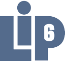

## Experience

<table>
    <thead>
        <tr>
            <th></th>
            <th>Company</th>
            <th>Role</th>
            <th>Dates</th>
        </tr>
    </thead>
    <tbody>
        <tr>
            <td></td>
            <td><a href="https://lip6.fr" target="_blank">Laboratoire d'Informatique de Paris 6 (LIP6)</a></td>
            <td>PhD Student</td>
            <td>11/2019 - Present</td>
        </tr>
        <tr>
	        <td colspan=4>
Stateful serverless computing functions are chained together through a message-based infrastructure and store their durable state in a separate data store. 
This separation between storage and compute creates serious challenges that may lead to inconsistency and application crashes.
Existing approaches are ad-hoc and do not ensure data consistency.

Based on a well-known message-based model (actors) and a state model (transactional shared memory), my work proposes a unified communication and persistence model called Transactional Turn Causal Consistency (TTCC). 
TTCC is asynchronous and preserves isolation internally and it ensures that the message and memory view are mutually consistent.

Keywords: Causal Consistency, Serverless, Actor Model, Shared Memory
			</td>
	    </tr>
		<tr>
            <td></td>
            <td><a href="https://www.esgi.fr" target="_blank">Ecole Supérieur de Génie Informatique (ESGI)</a></td>
            <td>Teacher in Parallel Programming</td>
            <td>09/2017 - 11/2019</td>
        </tr>
        <tr>
	        <td colspan=4>
Parallel programming teacher for 5th year students specialized in Software Architecture.
In-class lessons and group projects are in C++.
			</td>
		</tr>
        <tr>
            <td></td>
            <td><a href="https://www.aramislab.fr" target="_blank">Inria - ARAMIS</a></td>
            <td>R&D Engineer</td>
            <td>05/2018 - 10/2019</td>
        </tr>
    <tr>
	    <td colspan=4>
Based at the Brain and Spine Institute at the Pitié-Salpêtrière hospital in Paris, I was a member of the ARAMIS Inria team.
I participated the development of <a href="https://gitlab.com/icm-institute/aramislab/deformetrica" target="_blank">Deformetrica</a> which was ported from C++ to Python.
I contributed by optimizing the performance of the application to help PhD students run experiments on a bigger dataset.
Also, I contributed to <a href="https://github.com/getkeops/keops" target="_blank">PyKeops</a> which is used in Deformetrica to offload kernel operations.

I used the following technologies:  
- PyTorch: tensor library with auto-differentiation used within the Deformetrica application  
- Anaconda: library repository for Deformetrica  
- Python/Jupyter/Matplotlib/Nibabel: to prototype plot and read MR Images  
- C++/Cuda: Keops (kernel operations library)  
		</td>
    </tr>
		<tr>
            <td></td>
            <td><a href="https://www.tredzone.fr" target="_blank">Tredzone</a></td>
            <td>R&D Software Engineer</td>
            <td>07/2015 - 03/2018</td>
        </tr>
        <tr>
		    <td colspan=4>
Tredzone offers a high performance, low latency framework in C++ and Java for the capital market industry and other performance-hungry industries.  I contributed to the development of the C++ and Java actor model runtime.  
Additionally, we develop a library in C++11, which leverages our C++ actor framework to compose a high performance application.
Our framework is used in production at Euronext to power the core of their Optiq solution.

The following technologies are used:  
- C++11 : highly abstracted runtime and SDK  
- Solarflare : sub-microsecond feedhandlers  
- Java JNI : predictable latency Java runtime and SDK  
- Realtime Linux : tweaking for stable and ultra-low latency  
		    </td>
		</tr>
        <tr>
            <td></td>
            <td><a href="https://www.intel.com" target="_blank">Intel Corp</a></td>
            <td>HPC Application Engineer</td>
            <td>07/2014 - 12/2014</td>
        </tr>
        <tr>
		    <td colspan=4>
Intern at the Exascale research lab in Paris. The lab was founded by Intel, the University of Versailles Saint Quentin (UVSQ), le Commissariat à l’énergie atomique et aux énergies alternatives (CEA) and Grand Equipement National de Calcul Intensif (GENCI).  

I was involved in the analysis and code optimization of the <a href="https://gyseladoc.gforge.inria.fr" target="_blank">Gysela5D</a> gyrokinetic code for Intel's Many Integrated Core Architecture (Intel MIC/Xeon Phi) and Sandy Bridge Xeon Architecture.  
  
Keywords: Roofline Model, VTunes, Software Development Emulator (SDE), Intel compiler
		    </td>
	    </tr>
    </tbody>
</table>

---

## Education

<table>
    <thead>
        <tr>
            <th>School</th>
            <th>Link</th>
            <th>Degree</th>
            <th>Date</th>
        </tr>
    </thead>
    <tbody>
        <tr>
            <td></td>
            <td><a href="https://online.hbs.edu/" target="_blank">Sorbonne Université</a></td>
            <td>PhD in Distributed Systems</td>
            <td>2023</td>
        </tr>
        <tr>
            <td></td>
            <td><a href="https://uqac.ca" target="_blank">Université du Québec à Chicoutimi (UQAC)</a></td>
            <td>Master</td>
            <td>2014</td>
        </tr>
        <tr>
            <td rowspan=2></td>
            <td rowspan=2><a href="https://esgi.fr" target="_blank">Ecole Supérieur de Génie Informatique (ESGI)</a></td>
            <td>Masters - Software Architect</td>
            <td>2014</td>
        </tr>
        <tr>
            <td>Bachelor</td>
            <td>2012</td>
        </tr>
    </tbody>
</table>

---

## Publications

[6] **Benoît Martin** and Marc Shapiro. 2022. Shared memory for the actor model. In _Conférence francophone d’informatique en Parallélisme, Architecture et Système (COMPAS)_, Amiens, France. [https://2022.compas-conference.fr/programme/papiers/ComPAS2022_paper_2-2.pdf](https://2022.compas-conference.fr/programme/papiers/ComPAS2022_paper_2-2.pdf)

[5] **Benoît Martin**, Laurent Prosperi, and Marc Shapiro. 2020. An environment for composable distributed computing. [https://hal.inria.fr/hal-03146124](https://hal.inria.fr/hal-03146124)

[4] Baptiste Couvy-Duchesne, Johann Faouzi, **Benoît Martin**, Elina Thibeau–Sutre, Adam Wild, Manon Ansart, Stanley Durrleman, Didier Dormont, Ninon Burgos, and Olivier Colliot. 2020. Ensemble Learning of Convolutional Neural Network, Support Vector Machine, and Best Linear Unbiased Predictor for Brain Age Prediction: ARAMIS Contribution to the Predictive Analytics Competition 2019 Challenge. _Frontiers in Psychiatry_ 11, (2020). [https://www.frontiersin.org/articles/10.3389/fpsyt.2020.593336](https://www.frontiersin.org/articles/10.3389/fpsyt.2020.593336)

[3] Alexandre Bône, **Benoît Martin**, Maxime Louis, Olivier Colliot, and Stanley Durrleman. 2019. Hierarchical modeling of Alzheimer’s disease progression from a large longitudinal MRI data set.  [https://hal.inria.fr/hal-02090275](https://hal.inria.fr/hal-02090275)

[2] Alexandre Bône, Maxime Louis, **Benoît Martin**, and Stanley Durrleman. 2018. Deformetrica 4: An Open-Source Software for Statistical Shape Analysis. In _Shape in Medical Imaging_ (Lecture Notes in Computer Science), Springer International Publishing, Cham, 3–13. DOI:[https://doi.org/10.1007/978-3-030-04747-4_1](https://doi.org/10.1007/978-3-030-04747-4_1)

[1] Hamid Mcheick, Louis Deladiennee, Mickael Wajnberg, **Benoît Martin**, and Marc Abi-Khalil. 2014. Universal Connector Framework for Pervasive Computing Using Cloud Technologies. _Procedia Computer Science_ 34, (January 2014), 141–148. DOI:[https://doi.org/10.1016/j.procs.2014.07.072](https://doi.org/10.1016/j.procs.2014.07.072)

